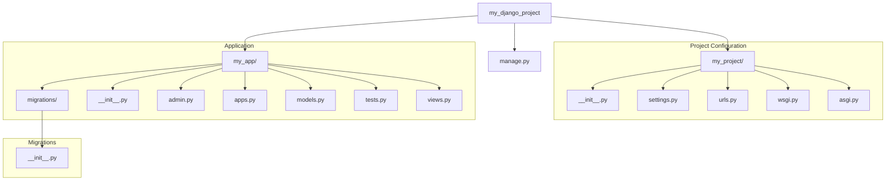

# 🍵🍵 cofffee_shop_inventory_managemet
It contains a IMS of  a coffee shop created using the python and Django Framework , and used the Sqlite3 for database 

# 📃 problem statement 
when a coffee shop owner wnats to manage there inventory , They had to keep daily check of there inventory in there book and update them on a daily bases ,so they can manage there inventory . 

## 👩🏼‍💻 Tech stack used in this 
The technological use case in this is Django Frame Work , Python programming language and UI features is also being used in this 

## 📂 File Structure :
The file structurer is consist of two main types of file where 1) is of project in which we are creating our product and the 2 ) is consist of apps floder shich is inside the project file, which is connecte with the certin file of the project file , hear the main file is the manage.py fiel which manage the integration of both the project and app folders integration and connection the Structure is as follows :

Here is a simple flow chart:




## key Django Files with code understanding and excution 
<h2>⚙️ manage.py</h2></br>
This file provides a command-line interface for interacting with the Django project. It is utilized for executing administrative tasks such as initiating the development server, creating new applications, and applying database migrations. Consequently, it functions as the primary utility for project management operations.

```ruby
#!/usr/bin/env python
"""Django's command-line utility for administrative tasks."""
import os
import sys


def main():
    """Run administrative tasks."""
    os.environ.setdefault("DJANGO_SETTINGS_MODULE", "coffee_shop_main.settings")
    try:
        from django.core.management import execute_from_command_line
    except ImportError as exc:
        raise ImportError(
            "Couldn't import Django. Are you sure it's installed and "
            "available on your PYTHONPATH environment variable? Did you "
            "forget to activate a virtual environment?"
        ) from exc
    execute_from_command_line(sys.argv)


if __name__ == "__main__":
    main()

```

<h2>🎛️ settings.py</h2></br>
As the central configuration file, settings.py governs the entire project's operational parameters. It contains critical definitions for the database connection, registered applications, middleware components, and other foundational configurations. This file is integral to defining the project's runtime behavior and its integration with various services.

<h2>🔗 urls.py</h2></br>
The urls.py file serves as the primary URL dispatcher for the project. It contains a mapping of URL patterns to their corresponding view functions, thereby directing incoming web requests to the appropriate application logic. This mechanism effectively serves as the navigational framework for the website.

```ruby
from django.contrib import admin
from django.urls import path
from coffee_shop_app import views

urlpatterns = [
    path("Do_not_open/", admin.site.urls),
    path('',views.Home,name="Home"),
    path('Menu/',views.menu,name="menu"),
    path("Bill/",views.bill,name="bill"),
    path("Contact_us/",views.contact,name="contact"),
    path("login/",views.Loginuser,name="login"),
    path("logout/",views.Logoutuser,name="logout")
]
```

<h2>💾 migrations/</h2></br>
This directory contains a version-controlled history of the database schema. Django's migration system automatically generates scripts within this folder in response to modifications in the models.py file. These scripts facilitate the systematic and reliable evolution of the database structure across different environments.
> [!NOTE]
> This is one of the migration:
```ruby
# Generated by Django 5.0.6 on 2024-05-27 12:02

import django.db.models.deletion
from django.db import migrations, models


class Migration(migrations.Migration):
    initial = True

    dependencies = []

    operations = [
        migrations.CreateModel(
            name="Inventory",
            fields=[
                (
                    "id",
                    models.BigAutoField(
                        auto_created=True,
                        primary_key=True,
                        serialize=False,
                        verbose_name="ID",
                    ),
                ),
                ("Coffee_type", models.CharField(max_length=220)),
                ("quantity", models.PositiveBigIntegerField(default=0)),
                ("price", models.PositiveIntegerField(default=0)),
                ("discripsion", models.TextField()),
                ("image", models.CharField(max_length=5000000)),
            ],
        ),
        migrations.CreateModel(
            name="Sales_Data",
            fields=[
                (
                    "id",
                    models.BigAutoField(
                        auto_created=True,
                        primary_key=True,
                        serialize=False,
                        verbose_name="ID",
                    ),
                ),
                ("quantity_sold", models.PositiveIntegerField(default=0)),
                ("price", models.IntegerField(null=True)),
                ("Total_Price", models.IntegerField(null=True)),
                (
                    "menu_items",
                    models.ForeignKey(
                        on_delete=django.db.models.deletion.CASCADE,
                        to="coffee_shop_app.inventory",
                    ),
                ),
            ],
        ),
    ]
```


<h2>🛡️ admin.py</h2></br>
The admin.py file is used to register application models with Django's built-in administrative interface. By registering a model, its data becomes accessible for creation, retrieval, updating, and deletion operations within the admin panel. This provides a powerful and convenient interface for data management.

```ruby
from django.contrib import admin
from coffee_shop_app .models import Inventory,Sales_Data,Contact,Bookings
# Register your models here.
admin.site.register(Inventory)
admin.site.register(Sales_Data)
admin.site.register(Contact)
admin.site.register(Bookings)
```

<h2>🧩 apps.py</h2></br>
Each application within a Django project includes an apps.py file for its specific configuration. This file allows for the definition of application-specific attributes and metadata. It is primarily used to declare the application's configuration class, which is then registered in the project's settings.py file.

```ruby
from django.apps import AppConfig


class CoffeeShopAppConfig(AppConfig):
    default_auto_field = "django.db.models.BigAutoField"
    name = "coffee_shop_app"
```

<h2>📜 models.py</h2></br>
The models.py file is where the data structure of an application is defined through Python classes. Each class, inheriting from django.db.models.Model, corresponds to a table in the database. This file, therefore, constitutes the definitive blueprint for the application's data storage and organization.

> [!IMPORTANT]
> You can create this type of tables for yoy Data base
```ruby
from django.db import models

class Inventory(models.Model):# Tablle for coffee items
    # Coffee_type, quantity, price, discripsion, image
    Coffee_type = models.CharField(max_length=220)
    quantity = models.PositiveBigIntegerField(default=0)
    price = models.PositiveIntegerField(default=0)
    discripsion = models.TextField()
    image = models.CharField( max_length=5000000)

    def __str__(self):
        return self.Coffee_type

class Sales_Data(models.Model):
    menu_items = models.ForeignKey(Inventory, on_delete=models.CASCADE)
    quantity_sold = models.PositiveIntegerField(default=0)
    price = models.IntegerField(null=True)
    Total_Price = models.IntegerField(null=True)

class Contact(models.Model):
    name=models.CharField( max_length=100)
    Email=models.CharField( max_length=254)
    phone=models.IntegerField(default=0)
    state=models.CharField(max_length=70)
    city=models.CharField( max_length=100)
    message=models.CharField( max_length=5000000000)
    date=models.DateField(null=True)

    def __str__(self):
        return self.name
class Bookings (models.Model):
    name=models.CharField(max_length=100)
    number=models.IntegerField(default=0)
    No_of_people=models.IntegerField(default=0)
    date=models.DateField(null=True)

    def __str__(self):
        return self.name
    
```

<h2>🧠 views.py</h2></br>
This file contains the core logic for processing incoming HTTP requests and generating appropriate HTTP responses. A view function or class-based view acts as the intermediary between a user's request and the application's data models and templates. It receives request data, executes the necessary business logic—which may involve querying the database via the models—and then returns a response, which is frequently a dynamically rendered HTML template populated with the retrieved data.

```ruby
from django.db import models

class Inventory(models.Model):# Tablle for coffee items
    # Coffee_type, quantity, price, discripsion, image
    Coffee_type = models.CharField(max_length=220)
    quantity = models.PositiveBigIntegerField(default=0)
    price = models.PositiveIntegerField(default=0)
    discripsion = models.TextField()
    image = models.CharField( max_length=5000000)

    def __str__(self):
        return self.Coffee_type

class Sales_Data(models.Model):
    menu_items = models.ForeignKey(Inventory, on_delete=models.CASCADE)
    quantity_sold = models.PositiveIntegerField(default=0)
    price = models.IntegerField(null=True)
    Total_Price = models.IntegerField(null=True)

class Contact(models.Model):
    name=models.CharField( max_length=100)
    Email=models.CharField( max_length=254)
    phone=models.IntegerField(default=0)
    state=models.CharField(max_length=70)
    city=models.CharField( max_length=100)
    message=models.CharField( max_length=5000000000)
    date=models.DateField(null=True)

    def __str__(self):
        return self.name
class Bookings (models.Model):
    name=models.CharField(max_length=100)
    number=models.IntegerField(default=0)
    No_of_people=models.IntegerField(default=0)
    date=models.DateField(null=True)

    def __str__(self):
        return self.name
    
```

